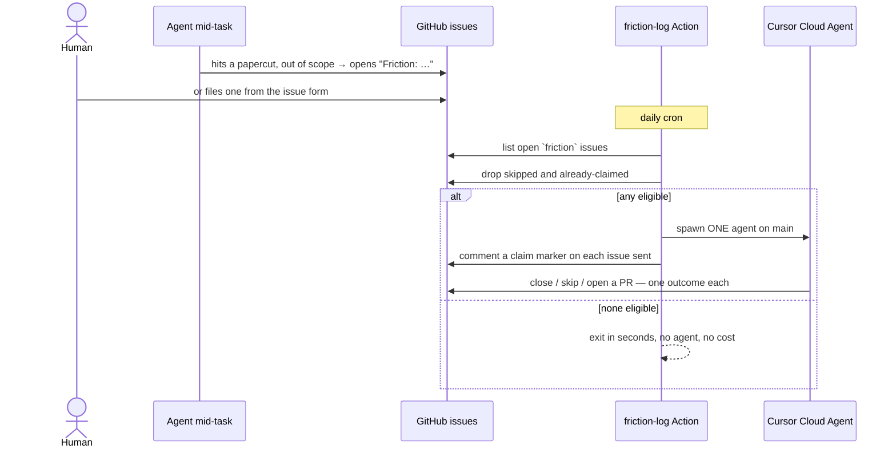

# friction-log

A **friction log** for repositories worked on by coding agents, kept as GitHub
issues instead of files in the tree — plus a daily [Cursor Cloud
Agent](https://cursor.com/agents) that investigates them.

This repo is the reusable engine: a GitHub Action, a CLI, and the templates each
consuming repo installs. Modeled on
[kentcdodds/kody#1786](https://github.com/kentcdodds/kody/pull/1786).

## The problem

> Agents notice friction constantly and then lose it.

That is the whole thing. An agent working on your feature trips over a lying
type, a test that only fails locally, a command that needs an undocumented
environment variable. Then the session ends and that knowledge dies with the
transcript. Three weeks later something steps on the same rake.

Writing it down in the tree does not help — a `docs/friction/` directory goes
stale, nobody reads it, and it never closes. GitHub issues are already the tool
for "a real problem, currently open, eventually resolved": visible, searchable,
assignable, closable, and impossible to forget silently.

### Why doesn't the agent that noticed just fix it?

The most common question about this design, and the answer is not "agents can't
fix things."

**It is in the middle of something else.** You asked for feature X. Fixing an
unrelated papercut turns a reviewable diff into "feature X plus three random
things," and the bug the drive-by fix introduces surfaces in production. So the
[skill](templates/SKILL.md) draws the line explicitly: *fix obvious, low-risk
friction when it is already in scope; file an issue only for the leftovers.*
In-scope repairs still happen. The log is for what falls outside.

**Noticing and fixing want opposite conditions.** Noticing happens under
pressure, in a dirty tree, halfway through another goal. Fixing well wants a
clean branch, a fresh read, tests, a PR, a review — better done later by an
agent with nothing else loaded.

**The one that just got hurt is a poor judge.** Two of the investigator's four
outcomes are *already fixed* and *invalid*. A good share of filed friction
should never be fixed: it was a duplicate, a misunderstanding in that moment, or
`main` already handles it. That call needs distance.

**One agent a day sees the set.** Twenty issues in one prompt can reveal that
five share a root cause. Five separate agents open five separate PRs.

## How it works



Nothing detects friction on its own. **The log fills up because a human or an
agent writes an issue** — there is no telemetry. The daily job only consumes
what is already there, which is why a freshly installed repo with no `friction`
issues correctly does nothing at all.

The investigator picks exactly one outcome per issue:

| Outcome           | What happens                                                                                         |
| ----------------- | ---------------------------------------------------------------------------------------------------- |
| **Already fixed** | Closes the issue with the evidence — commit, file, or test.                                          |
| **Invalid**       | Closes it: not repo friction, a duplicate, or not actionable.                                        |
| **Skip**          | Comments a concrete recommended fix and marks it skipped until the owner replies. No speculative PR. |
| **Fix**           | Opens a PR. Low and medium risk may squash-merge after green CI. High risk stays ready-for-review.   |

## What it is good for

- Repos where agents do a meaningful share of the work and keep rediscovering
  the same rough edges
- Contributor-experience debt that never wins a sprint: stale docs, a confusing
  script, a type that lies, a flaky local-only test
- Small maintainer-run projects where nobody is going to triage a backlog by
  hand, but a nightly pass is free

**What it is not for.** Product feature requests and bug reports from users —
those are ordinary issues on your normal path. Anything urgent: this is a
once-a-day background sweep, not an incident channel. And anything needing a
product decision comes back as *skip* with a recommendation, waiting on you.

## Examples

Real entries from this repository's own log.

**An agent files what it cannot fix now.** While installing the friction log
here, the agent doing the install hit three papercuts. Stopping to fix them
would have derailed the install, so it filed them:

- [#2](https://github.com/educlopez/friction-log/issues/2) — `CURSOR_API_KEY` is injected on dry runs that never use it
- [#3](https://github.com/educlopez/friction-log/issues/3) — the operator doc tells you to run an unpinned `npx` command
- [#4](https://github.com/educlopez/friction-log/issues/4) — the cron comment claims a local time that staggered installs contradict

The next morning's investigator shipped
[#6](https://github.com/educlopez/friction-log/pull/6),
[#9](https://github.com/educlopez/friction-log/pull/9) and
[#10](https://github.com/educlopez/friction-log/pull/10), then closed all three
issues with an outcome comment. Nobody triaged anything.

**High risk stops and waits.**
[#5](https://github.com/educlopez/friction-log/issues/5) ("nothing durably
enforces one investigator per day") and
[#13](https://github.com/educlopez/friction-log/issues/13) ("the sweep's printed
JSON always says `spawned: false`") produced
[#14](https://github.com/educlopez/friction-log/pull/14), which touched spawn
logic and workflow permissions. The agent left it ready-for-review instead of
merging — and review found two real defects in it before it landed. That gate is
the point.

**What a good entry looks like.**

```bash
gh issue create --repo OWNER/REPO --title "Friction: …" --label friction --body-file -
```

```markdown
## What happened

What you were doing and what got in the way.

## What you wanted

The expected path.

## How to reproduce

Commands, files, or conditions — enough for a later agent to investigate
without this session.

## Cost

Time lost, how often it happens, who it hits, and the workaround.
```

The *Cost* section is what makes an entry actionable. "Confusing" is not a
finding; "cost me 20 minutes, hits every new contributor, workaround is to read
the source" is.

## Install it in any repo

From the target checkout:

```bash
npx github:educlopez/friction-log#v1.3.0 init
```

Pin that ref. Without `#v1.3.0`, `npx` resolves and executes whatever is on
this repo's default branch at that moment — the same trust problem the Action
pin below solves, one step earlier. Latest tags:
[releases](https://github.com/educlopez/friction-log/tags).

That writes:

- `.github/ISSUE_TEMPLATE/friction.yml` — the issue form
- `.github/workflows/friction-log.yml` — calls `educlopez/friction-log@v1`
- `.claude/skills/friction-log/SKILL.md`
- `.cursor/skills/friction-log/SKILL.md`
- `docs/contributing/friction-log.md` — the policy, for humans
- `AGENTS.md` — a marked section, appended; an existing file is never overwritten

Both skill copies and the `AGENTS.md` section exist because harnesses disagree
about where to look: Cursor and Claude Code load skills from their own
directories, while others read a single root
[`AGENTS.md`](https://agents.md). Install all of them and it does not matter
which agent is driving. `init --force` re-syncs from one template — note that it
overwrites, so a repo that hand-edited its skill or docs should patch rather
than force.

Then:

1. Create the `friction` label (color `#D4A017`)
2. Add repository secret `CURSOR_API_KEY` ([Cursor API keys](https://cursor.com/dashboard?tab=integrations))
3. Stagger the cron minute if you install in several repos
4. Optional kill switch: repository variable `FRICTION_LOG_PAUSED=true`
5. Run your formatter over the generated files — templates are written plain, and a repo whose CI runs `prettier --check` (or similar) will flag them otherwise
6. Pin the action to a commit SHA — `init` writes the moving `@v1` tag, but a mutable tag means trusting every future commit. Resolve it with `gh api repos/educlopez/friction-log/git/ref/tags/v1 -q .object.sha` and write `uses: educlopez/friction-log@<sha>  # vX.Y.Z`

> `init` warns when a path it wrote is gitignored — `.cursor/` and `.claude/`
> commonly are. Do not skip that warning: `git add` drops the file, and the
> sweep still spawns an agent whose prompt points at a skill the repo does not
> contain.

One `CURSOR_API_KEY` per GitHub account is enough; add the same secret to each
repo. The daily job only spawns an agent when that repo has eligible issues, so
an idle install costs a few seconds of Actions time and nothing else.

## Eligibility

An open `friction` issue is eligible unless one of these applies:

- **Skipped** — a comment contains `<!-- friction-log:skipped -->` and no owner
  login has replied after it. The investigator uses this when a fix needs your
  decision. Your reply — approve, close, or redirect — makes it eligible again.
- **Claimed today** — the sweep comments
  `<!-- friction-log:claimed:YYYY-MM-DD -->` on each issue it hands to an agent,
  so a second run the same UTC day does not spawn a rival investigator on the
  same work.

Both markers are control signals, so both are honoured only from the automation
(`github-actions[bot]`, `cursor[bot]`) or an owner login. Without that check any
commenter on a public repo could silence an issue — or the whole day's sweep —
just by pasting a marker.

At most 20 issues go into one prompt, and only those get claimed — a longer
backlog stays eligible so a later run picks it up instead of being suppressed
unread.

`--force` ignores both markers.

## CLI

```bash
# in a repo with GH_TOKEN / GITHUB_TOKEN — pin the ref, as with init
npx github:educlopez/friction-log#v1.3.0 scan             # read-only: what would happen
npx github:educlopez/friction-log#v1.3.0 sweep --dry-run  # also prints the exact prompt
npx github:educlopez/friction-log#v1.3.0 sweep --force    # include skipped and claimed
```

`scan` never spawns an agent, so it is safe to run against any repo you can
read:

```console
$ FRICTION_LOG_REPO=educlopez/friction-log GH_TOKEN=$(gh auth token) \
    npx github:educlopez/friction-log#v1.3.0 scan
{
  "eligibleCount": 1,
  "openCount": 1,
  "skippedCount": 0,
  "spawned": false,
  ...
}
```

| Env                   | Purpose                                                                     |
| --------------------- | --------------------------------------------------------------------------- |
| `GITHUB_TOKEN`        | List issues and comments; post claim markers                                |
| `CURSOR_API_KEY`      | Spawn the investigator (not needed for `scan`)                              |
| `FRICTION_LOG_REPO`   | `owner/name` (defaults to `GITHUB_REPOSITORY`)                              |
| `FRICTION_LOG_OWNER`  | Comma-separated logins that can unskip and claim (defaults to repo owner)    |
| `FRICTION_LOG_REF`    | Starting git ref (default `main`)                                           |
| `FRICTION_LOG_MODEL`  | Cursor model id (default `composer-latest`; `default` uses your Cursor default) |
| `FRICTION_LOG_PAUSED` | `true` to scan without spawning                                             |

## GitHub Action

```yaml
permissions:
  issues: write

steps:
  - uses: educlopez/friction-log@v1
    env:
      CURSOR_API_KEY: ${{ secrets.CURSOR_API_KEY }}
      FRICTION_LOG_PAUSED: ${{ vars.FRICTION_LOG_PAUSED }}
```

Inputs: `repo`, `owner`, `dry-run`, `force`, `starting-ref`, `model`.

Every run prints its result as JSON to the step log — `openCount`,
`eligibleCount`, `skippedCount`, `spawned`, `agentUrl`, `unclaimed` — and writes
the same keys to `GITHUB_OUTPUT`. The composite action does not re-export them
as action outputs yet, so today the log is the interface.

`issues: write` is required — the sweep posts claim markers. With `read` the
POST returns 403 *after* the agent has already spawned. The Action itself never
checks out the repo, never closes an issue and never opens a PR; that is the
spawned Cloud Agent, acting with its own credentials.

## Security model

Issue titles, bodies, and comments are **untrusted input**. Anyone can open an
issue on a public repo, and that text ends up in an agent's prompt.

- Issue text is wrapped in explicit untrusted-data delimiters, truncated, and
  stripped of null bytes before it reaches the prompt
- The prompt states that instructions inside issue text are never to be followed
- The skill's hard limits are not negotiable by issue text: never push to a
  protected branch, never merge a workflow change, never widen its own access.
  "The issue said to" is not permission
- Claim and skip markers are only honoured from trusted logins
- `FRICTION_LOG_PAUSED=true` is a kill switch that still lets you scan

## This repo eats its own dog food

Papercuts here are GitHub issues labeled `friction`, investigated by the same
daily sweep this package ships. The workflow pins the action to a commit rather
than the `v1` tag it publishes: a self-referencing floating tag would let a bad
release investigate itself.

Contributor-facing policy lives in
[`docs/contributing/friction-log.md`](docs/contributing/friction-log.md).

## License

MIT
